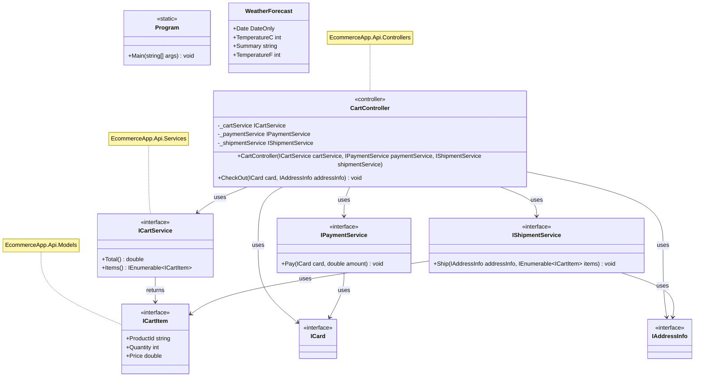

# Diagrama de Clases - EcommerceApp.Api

```mermaid
classDiagram
    %% Interfaces
    class ICartService {
        <<interface>>
        +Total() double
        +Items() IEnumerable~ICartItem~
    }
    
    class ICartItem {
        <<interface>>
        +ProductId string
        +Quantity int
        +Price double
    }
    
    class IPaymentService {
        <<interface>>
        +Pay(ICard card, double amount) void
    }
    
    class IShipmentService {
        <<interface>>
        +Ship(IAddressInfo addressInfo, IEnumerable~ICartItem~ items) void
    }
    
    class ICard {
        <<interface>>
    }
    
    class IAddressInfo {
        <<interface>>
    }
    
    %% Controllers
    class CartController {
        <<controller>>
        -_cartService ICartService
        -_paymentService IPaymentService
        -_shipmentService IShipmentService
        +CartController(ICartService cartService, IPaymentService paymentService, IShipmentService shipmentService)
        +CheckOut(ICard card, IAddressInfo addressInfo) void
    }
    
    %% Program Class
    class Program {
        <<static>>
        +Main(string[] args) void
    }
    
    %% WeatherForecast (if exists based on coverage)
    class WeatherForecast {
        +Date DateOnly
        +TemperatureC int
        +Summary string
        +TemperatureF int
    }
    
    %% Relationships
    CartController --> ICartService : uses
    CartController --> IPaymentService : uses
    CartController --> IShipmentService : uses
    CartController --> ICard : uses
    CartController --> IAddressInfo : uses
    ICartService --> ICartItem : returns
    IShipmentService --> ICartItem : uses
    IPaymentService --> ICard : uses
    IShipmentService --> IAddressInfo : uses
    
    %% Namespace annotations
    note for ICartService "EcommerceApp.Api.Services"
    note for ICartItem "EcommerceApp.Api.Models"
    note for CartController "EcommerceApp.Api.Controllers"
```